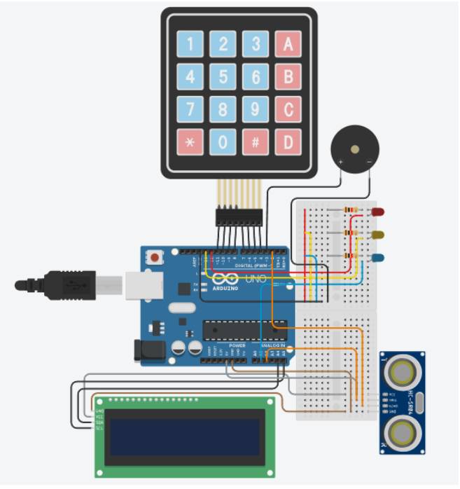

# Juego de adivinanza y medición con Arduino

**Proyecto Final - Arduino**

---

##  Grupo 6

**Integrantes:**
- Manuel Alcoceba (manualcoceba@gmail.com) 
- Valentín Mokorel  (valenmokorel@gmail.com)
- Matías Miremont (matimiremont@gmail.com) 
- Ramiro Arbelo  (ramiroarbelo05@gmail.com)

---

##  Docente y Materia

**Materia:** Laboratorio de computacón I

**Docentes:** Pedro Iriso y Matías Gagliardo

---

##  Descripción General del Proyecto

Este proyecto consiste en un **juego interactivo** desarrollado con **Arduino UNO** que combina **adivinanzas, luces, sonidos y un sensor ultrasónico**.  
El sistema invita al usuario a **adivinar un número entre 10 y 20** utilizando un teclado matricial 4x4. A través de una **pantalla LCD** se muestran mensajes de ayuda, y mediante **LEDs de colores** el sistema indica qué tan cerca está la respuesta.

Cuando el jugador acierta el número, el sistema:
- Reproduce una **melodía de victoria** mediante un buzzer.
- Pasa a una **segunda etapa**, donde el jugador debe **colocar un objeto a una distancia del sensor ultrasónico** igual al número adivinado.
- Si el jugador **no adivina** el número secreto se reproduce una melodía mostrando **Game Over** mediante la pantalla 

El juego combina elementos de **entrada/salida digital, sensores, control por tiempo, música y lógica de estados**.

---

## Requisitos Funcionales Cumplidos

- **Control de Entradas y Salidas:**  
  El sistema utiliza **entradas digitales** (keypad) y **salidas digitales** (LEDs y display LCD).  
  Estas señales permiten gestionar las interacciones del usuario y mostrar la información del juego.

- **Contador de Flancos:**  
  Se implementa mediante la **detección de cambios de estado** en las teclas presionadas.  
  Cada flanco ascendente detectado representa una pulsación válida, lo que evita repeticiones o lecturas falsas.

- **Control Lógico por Tiempo:**  
  El programa emplea **temporizaciones controladas** con funciones como `millis()` o `delay()` para realizar acciones secuenciales (por ejemplo, parpadeos o pausas informativas) sin afectar la ejecución general del sistema.

- **Control Lógico por Máquina de Estados:**  
  El código se estructura en **estados definidos** (como espera, comparación, acierto y reinicio).  
  Las transiciones entre estos estados dependen de las **entradas del usuario y el resultado obtenido**, garantizando un flujo lógico y estable en la operación del sistema.

---

##  Componentes Utilizados

| Componente | Descripción / Conexión |
|-------------|------------------------|
| **Arduino UNO** | Microcontrolador principal |
| **Pantalla LCD 16x2 (I2C 0x27)** | Comunicación I2C |
| **Keypad 4x4** | Filas: 8,9,10,11 — Columnas: 4,5,6,7 |
| **LEDs** | Rojo (12), Amarillo (13), Azul (A1) |
| **Buzzer** | Pin 3  |
| **Sensor ultrasónico HC-SR04** | Trigger (A2), Echo (2) |
| **Resistencias (3)** | Limitadoras para LEDs |
| **Protoboard y cables** | Conexiones generales |
| **Alimentación** | 5V DC |

---
## Esquema eléctrico / diagrama de conexiones

---

## Máquina de estados (diagrama o explicación) //FALTA COMPLETAR
**1. Inicio**
- Se genera un número aleatorio.
- Se muestra el primero intento para adivinar dicho numero sobre el keypad.

**2. Ingreso de número**
- El usuario escribe un valor entre 10 y 20.
- Si es inválido, se solicita otro.

**3. Evaluación**
- Si es correcto, suena una señal sonora de victoria y se pasa al estado de juego de distancia con el sensor ultrasónico.
- Si es incorrecto, se muestran pistas con leds y se avanza al siguiente intento.
- Si no quedan intentos,se pasa al estado de derrota.

**4. Juego de distancia con sensor ultrasónico**
- El usuario debe ubicar un objeto a la distancia indicada por el numero aleatorio adivinado.
- Una vez que coincide, se termina el juego.

**5. Derrota**
- Señal sonora y visual de derrota.
- Muestra el número aleatorio generado por el keypad.
- Reinicio del juego.
---

##  Instrucciones de uso y ejecución  //FALTA COMPLETAR
1. Conectar y encender el Arduino.
2. Esperar la pantalla que indica que comienza el primer intento.
3. Ingresar un número entre 10 y 20 usando el keypad.
4.Confirmar con # o borrar con *.
5. Según la cercanía, los LEDs indicarán si estás lejos o cerca.
6. Si acertás el número, esperar la canción y luego seguir la indicación del sensor ultrasónico para ubicar el objeto.
7. Si fallás tres veces, el juego finalizará con una cancion y se reiniciará solo.
---

## Imágenes o video demostrativo

---

##  Licencia y créditos   // FALTA COMPLETAR 

---

